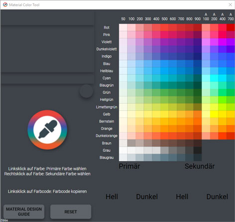

# Material Color Tool

Eine einfache Möglichkeit die Farben von Googles Material Design zu verwenden. Dieses Programm stellt alle Farben des Material Designs zur verfügung, damit diese nur noch kopiert werden müssen. Beispiele und ein kurzer Leitfaden sind im Programm enthalten. Das Programm wurde in C# und WPF geschrieben.

## Installation

Es muss lediglich die setup_materialcolortool.exe gestartet werden und dem Setup gefolgt werden! Zu finden ist diese Datei unter dem Release Tab.

## Benutzung

Sobald das Programm gestartet wurde, kann mit einem Linksklick eine primäre und mit einem Rechtsklick eine sekundäre Farbe im rechten Teil gewählt werden. Ausgewählte Primär- und Sekundärfarben werden unten rechts angezeigt.
Um einen Farbcode zu kopieren, muss lediglich ein Linksklick auf den Farbcode getätigt werden. Der Hexadezimal-Farbcode befindet sich dann in der Zwischenablage.